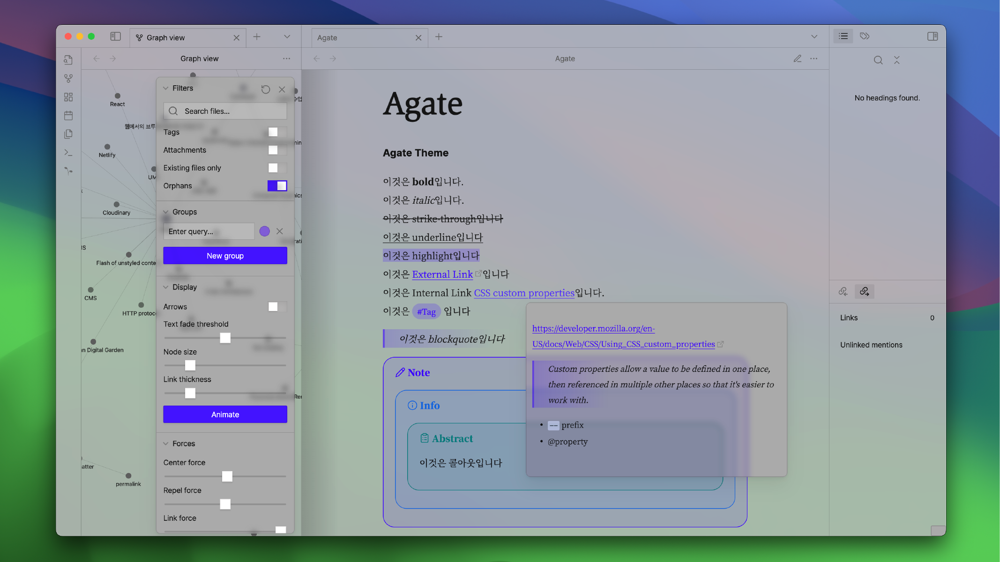

옵시디언 테마를 내맘대로 뜯어고치자.

## 시작하기
[[01-hello-theme-css]]
## 디자인하기
[[03-micro-typography-in-obsidian]]  
[[02-macro-typography-in-obsidian]]  
→  [[obsidian-plugins-i-used]]
## 제출하기
[[04-submit-your-theme]]

## 추가 하고싶은것
- 내부링크 달 때 뜨는 창이 투명한거 고치기
- 다크모드
- live preview와 reading view 간극 좁히기
- 합성글꼴 플러그인 개발
- excalidraw, 데이터베이스 등 플러그인 사용
- 좀더 재밌게 발전시키기