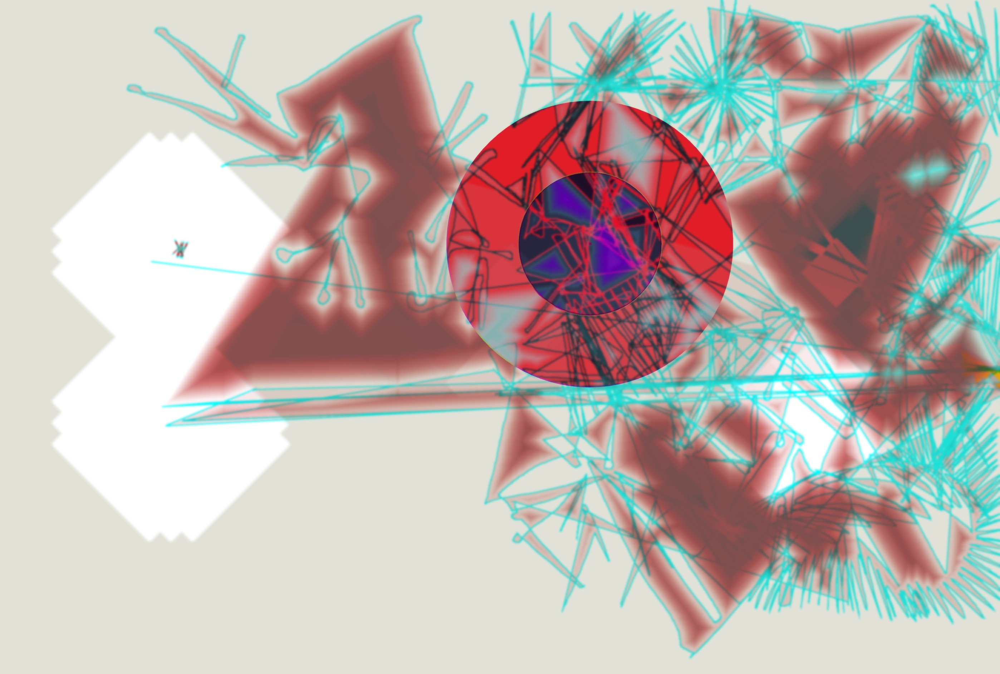

---
aliases:
  - Brush Library
layout: ../../layouts/WorksLayout.astro
type: works
tags:
  - web
  - p5_js
thumbnail: /brush_library.png
date: 2023
description: 화면에 그림을 그릴 수 있는 웹사이트를 제작했습니다. 버튼을 클릭해 브러쉬를 바꿀 수 있습니다.
---
<figcaption>사용 화면</figcaption>

<iframe src="https://www.youtube.com/embed/Qq6jz3wIfuE?si=t4q0feIADoNwFymP" title="YouTube video player" frameborder="0" allow="accelerometer; autoplay; clipboard-write; encrypted-media; gyroscope; picture-in-picture; web-share" referrerpolicy="strict-origin-when-cross-origin" allowfullscreen></iframe>

<figcaption>초기 화면</figcaption>

<figcaption>2023학년도 국민대학교 시각디자인학과 소모임 연합 전시회 모임모임</figcaption>

<figcaption>Brush Library를 이용해 그린 그림들</figcaption>

[Brush Library](https://solm0.github.io/brush-library/)