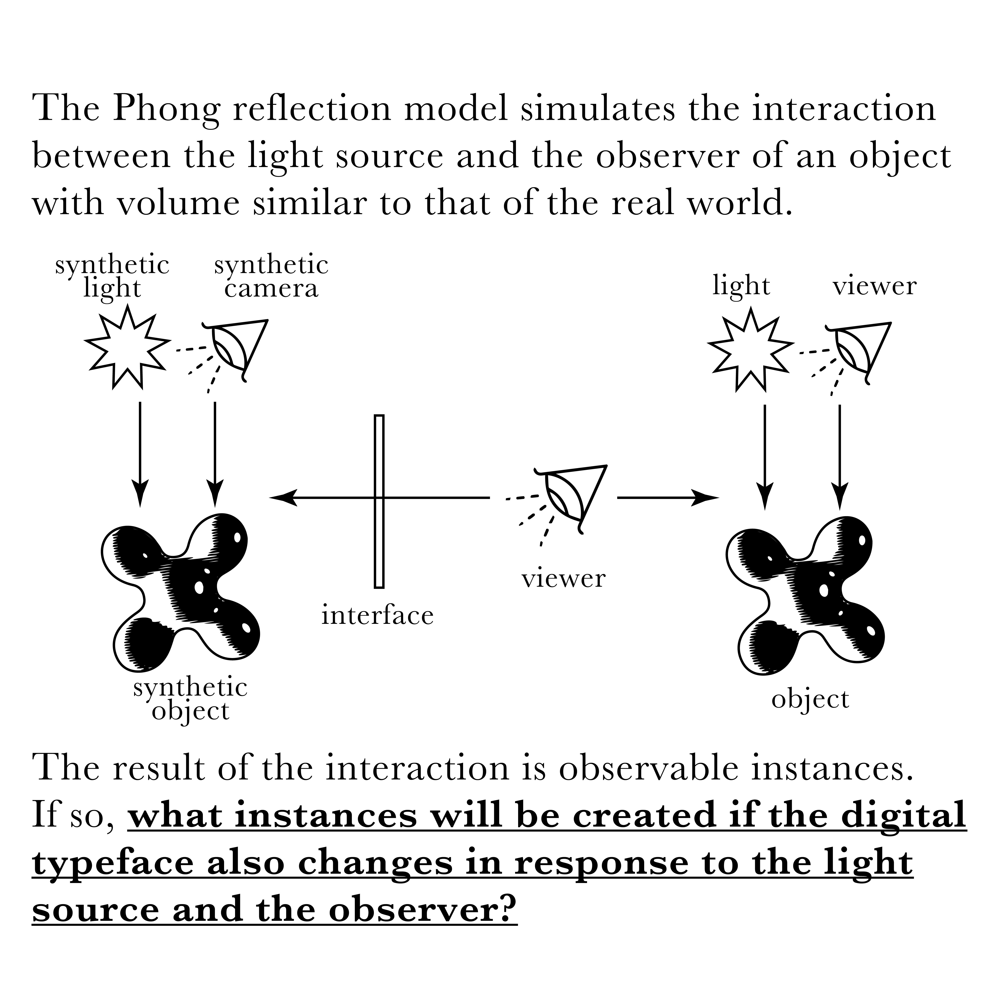
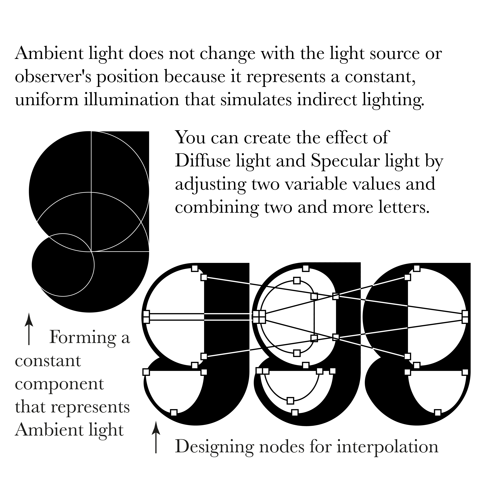
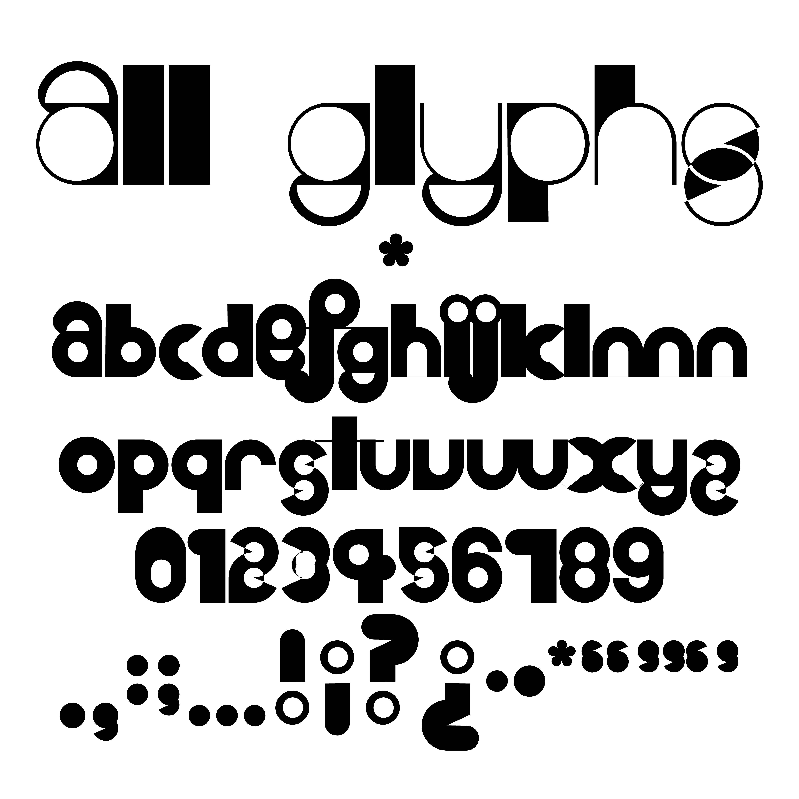

<figcaption>베리어블 폰트 영상</figcaption>

  
  

<figcaption>서체 개발노트</figcaption>

<figcaption>서체 견본 포스터 '49th Anniversary Conference'</figcaption>

<figcaption>렌티큘러 포스터</figcaption>

<figcaption>국민대학교 시각디자인학과 2024-1 과제전</figcaption>

