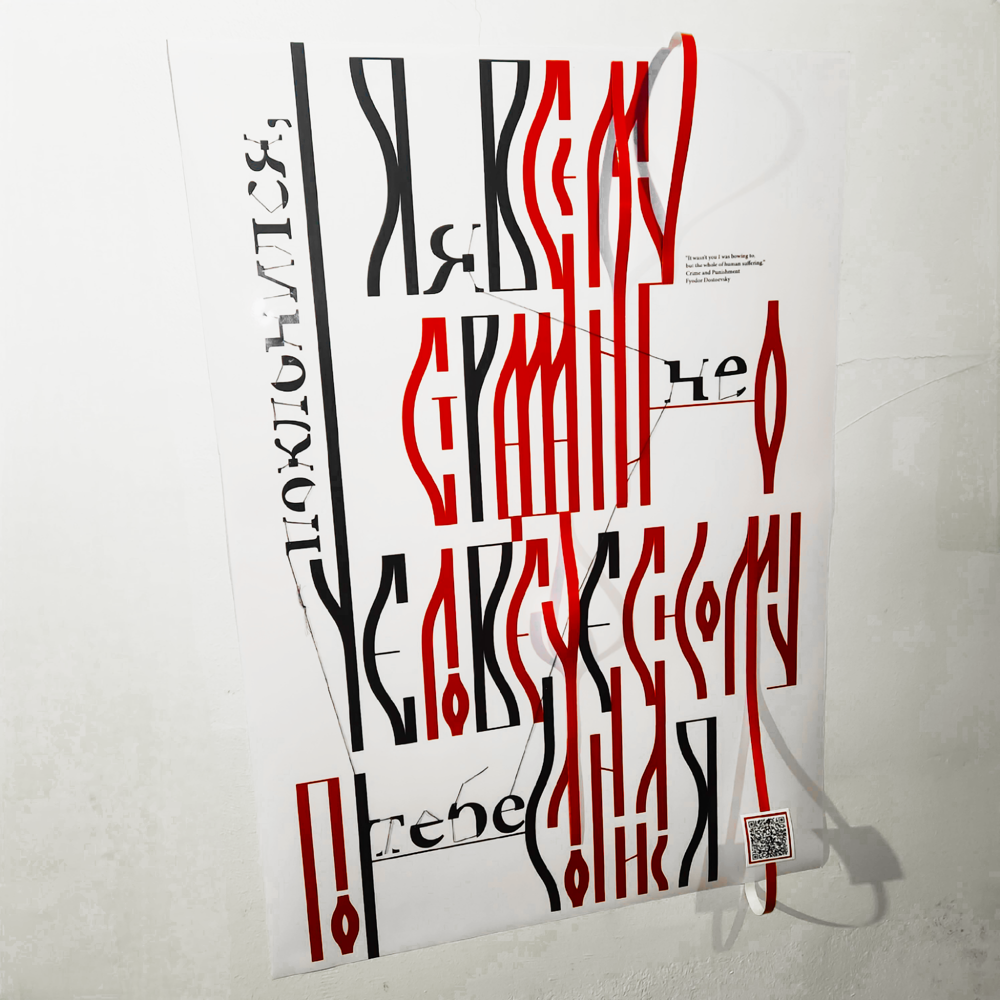

---
aliases:
  - Я не тебе поклонился...
layout: ../../layouts/WorksLayout.astro
type: works
tags:
  - web
  - reading
  - russian
  - cyrillic_script
  - poster
thumbnail: /it-wasnt-you.png
date: 2023-11
description: 도스토옙스키의 소설 '죄와 벌' 중 대사 '나는 당신에게 절한 것이 아니라, 온 인류의 고통에 절한 거야 Я не тебе поклонился, я всему страданию человеческому поклонился.'를 레터링해 포스터를 만들었습니다.
---

<figcaption>포스터</figcaption>

<figcaption>국민대학교 시각디자인학과 2023 과제전</figcaption>

<figcaption>'죄와 벌'은 도시를 중심으로 급속한 근대화가 이루어지면서 빈부 격차가 커지던 1866년 러시아 제국 시기 쓰인 소설이다. 가난한 휴학생 라스콜니코프가 고리대금업자 노파를 살해하며 소설이 시작하고, 점차 그 동기인 열등감과 초인사상이 모습을 드러낸다. 내가 선정한 대사는 4장에서 라스콜니코프가 비참한 상황 속에서도 흔들리지 않는 소냐의 신에 대한 믿음에 도전하다 갑자기 발에 입 맞추며 한 말이다. 이 뜬금없는 대사를 통해 라스콜니코프는, 그리고 도스토옙스키는 무엇을 말하고자 한 걸까?</figcaption>

<figcaption>소설의 에필로그에 ‘변증법 대신 삶이 도래했다’라는 문장이 있다. 시베리아 유형 후 과거를 털어내고 도스토옙스키는 자신의 문학 내에서 인간 본성을 합리성으로 단순화하는 사회주의자 유토피아 교리에 대한 공격을 계속한다. 이러한 배경을 단서로 볼 때, 이 대사는 합리성의 몽상에서 고통을 직시하는 실존주의로의 전환을 암시하고 있다고 보았다. 이를 ‘이념에서 원형으로’라고 함축한 뒤, ‘이념’과 ‘원형’을 각각 레터링하여 섞어짜기로 했다.</figcaption>

<figcaption>먼저 ‘이념’ 레터링에서는, 비합리적일 수밖에 없는 인간의 자기합리화를 나타내고자 했다. 라스콜니코프는 자신의 살인에 초인사상을 가지고 와 합리화하고 싶어하지만 <b>’나는 세상의 이를 죽인 것이다’</b> 끝내 자기기만이었음을 인정한다. <b>’나는 나를 위해서 죽인 것이야’</b> 고전적인 인쇄체 글자의 세리프와 연결 부분 등 나머지 형태를 유추할 수 있도록 일부분만 남기고 지운 다음, 그 조각들을 앙상한 선으로 다시 연결해 표현하였다.</figcaption>

<figcaption>라스콜니코프는 4장에서 소냐에게 라자로의 부활 대목을 읽어달라고 함으로써 부활이 암시된다. 소냐는 기독교적 상징으로, ‘이념’의 반대편 ‘원형’을 대표하고 있다고 보았다. 그래서 ‘원형’ 레터링의 형태는 시간을 거슬러 올라가 기독교의 선교와 동시에 탄생한 초기 키릴문자에서 힌트를 얻었다. 키릴문자는 기독교와 함께 성장하며 독특한 리가처 시스템 Вязь를 발달시켰는데, 빽빽하게 들어찬 그것의 모양이 나에게는 글자들이 가지를 뻗고, 서로 끌어안고 연결되며 그 자체로 종교적 원형을 드러내 보이고 있는 것처럼 느껴졌다. 그래서 그것을 바탕으로 새로운 리가처 규칙을 만들어 적용하고, 리가처가 적용된 부분을 붉은색으로 나타냈다.</figcaption>

<figcaption>‘원형’ 레터링을 변형하여 만든 사이사이 공간에 ‘이념’ 레터링을 배치하여 이성은 본성으로부터 나온 불완전한 것이고 이성에서 본성을 분리할 수 없음을 나타냈다.
</figcaption>