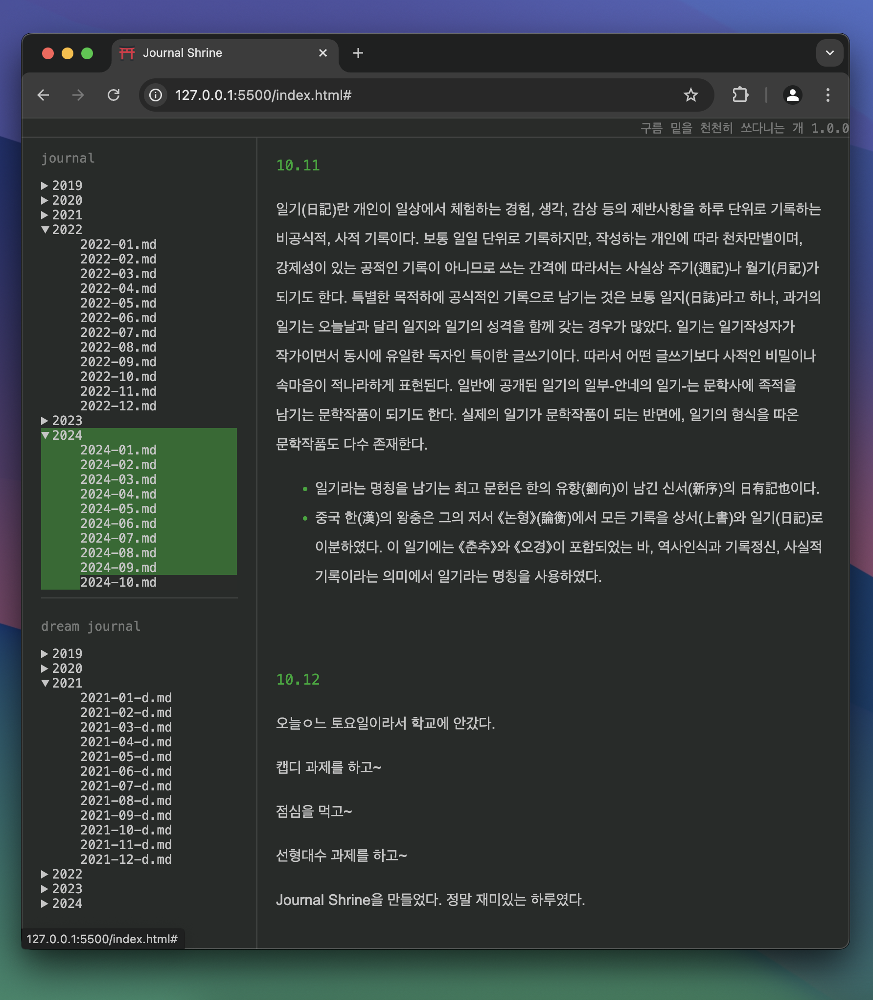
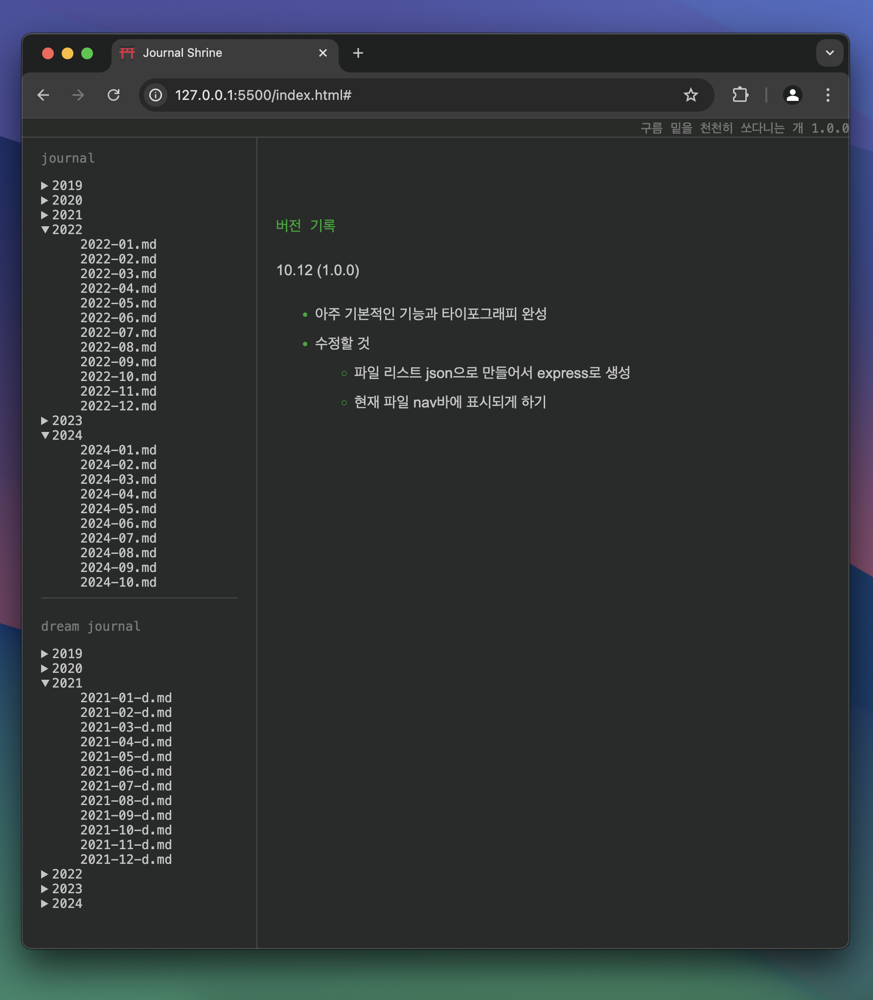

---
aliases:
  - Journal Shrine
layout: ../../layouts/WorksLayout.astro
type: works
tags:
  - journaling
  - html
thumbnail: /journal_shrine_1.png
date: 2024-10
description: 수년간 각종 앱을 전전하던 일기 데이터를 Markdown 포맷으로 전환해 개인 저장소로 옮기고 전용 뷰어를 제작했습니다.
---
<figcaption>사용 화면</figcaption>

<figcaption>tmi: 이 뷰어의 디자인은 의도적으로 에버노트를 닮았습니다. 일기 용도로 가장 오랜 기간 사용했던 앱이어서 익숙하기 때문입니다.</figcaption>

<figcaption>스크린샷</figcaption>

## 관련 문서
[[journal-shrine-development|로컬 일기 뷰어 만들기]]