---
aliases:
  - Labrouste
layout: ../../layouts/WorksLayout.astro
type: works
tags:
  - typeface
  - poster
  - web
thumbnail: /labrouste.png
date: 2023-09
description: labrouste는 고전 건축의 대칭적 구조와 철골이라는 새로운 재료가 만나 탄생한 19세기의 건축물들을 모티브로 만들어진 세벌식 조합형 서체입니다. 건축물의 부품을 주조하듯이 낱자를 그리고, 건축물을 짓듯이 글자를 조립하였습니다.
---
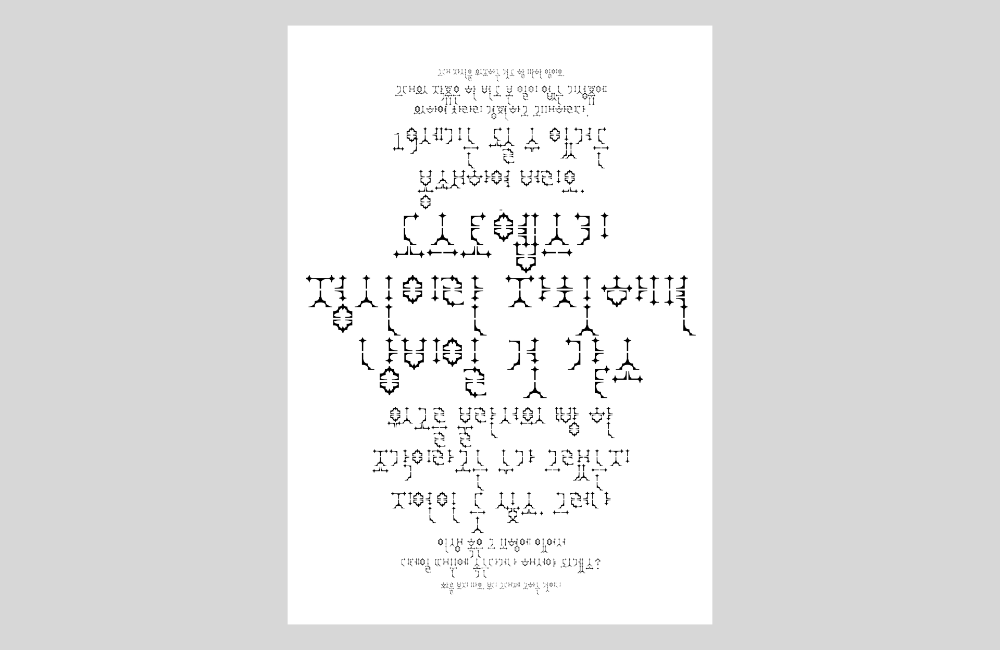

<figcaption>포스터, 엽서</figcaption>

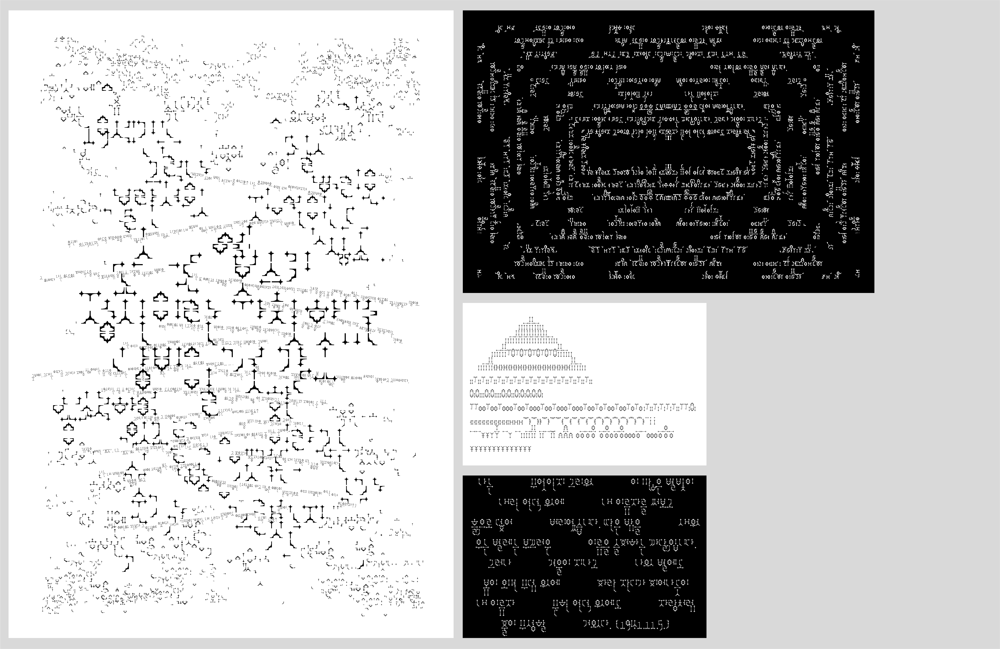

<figcaption>서체 견본집</figcaption>

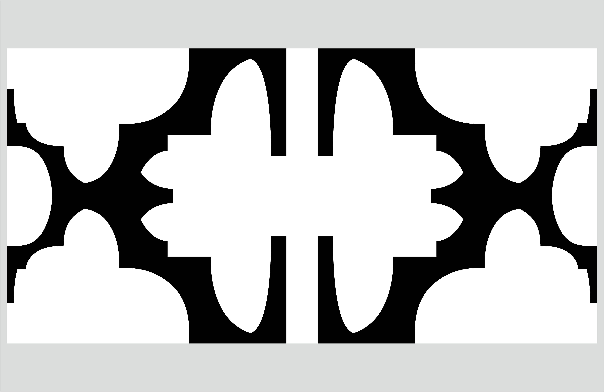
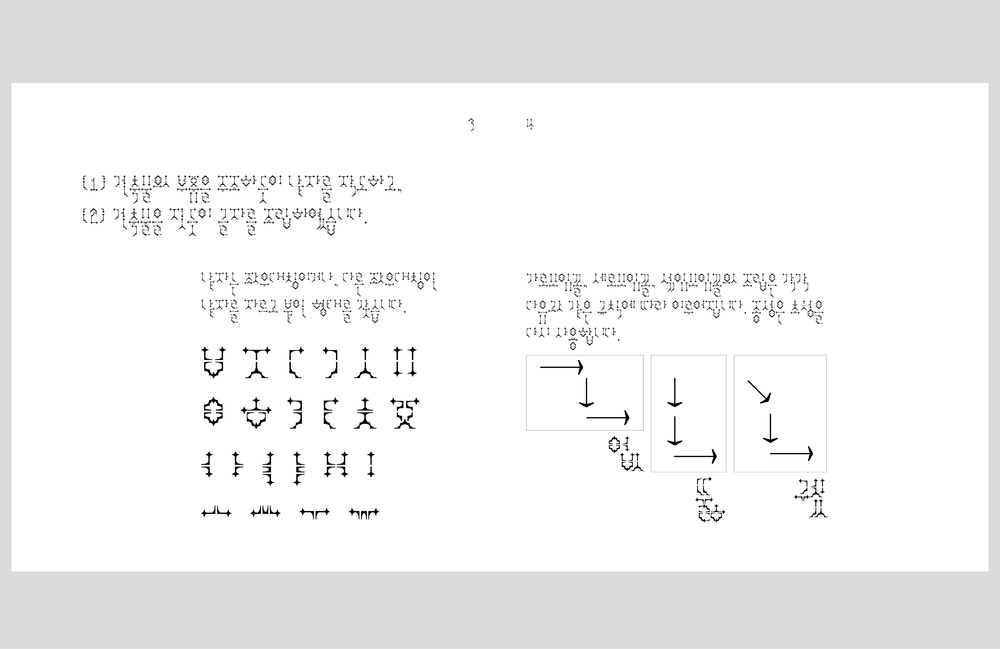
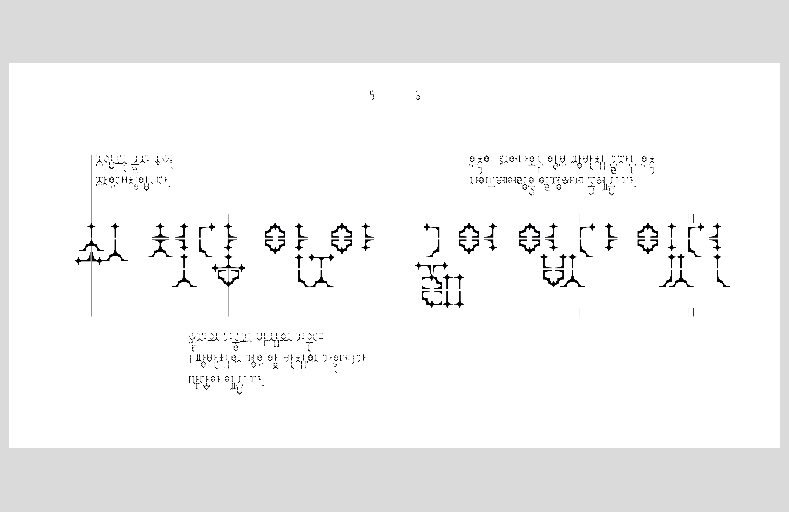
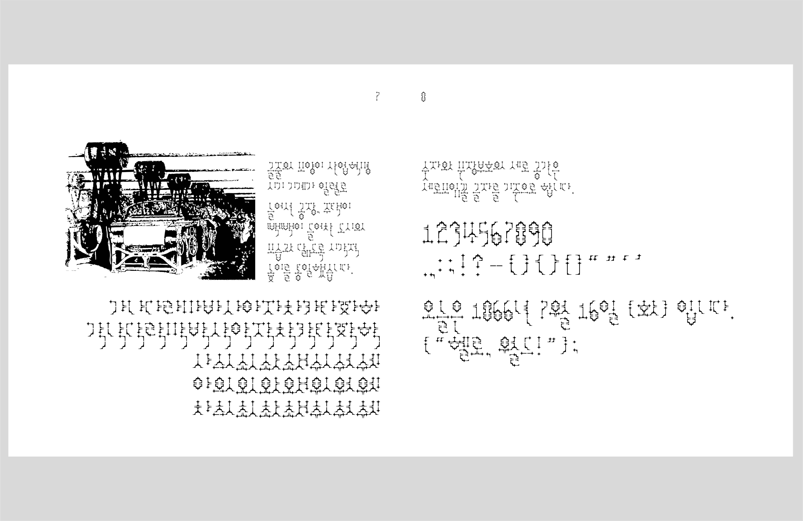
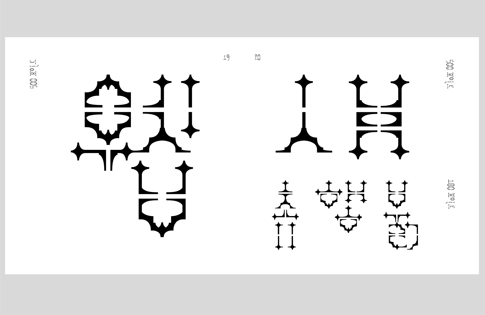
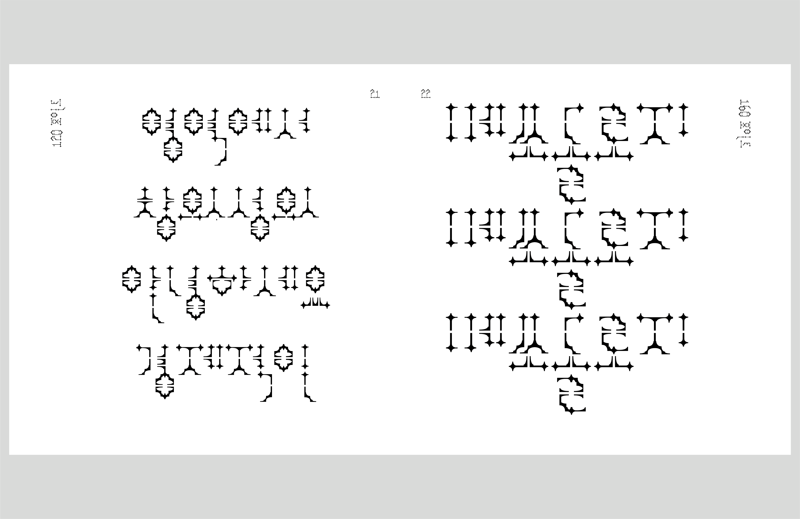
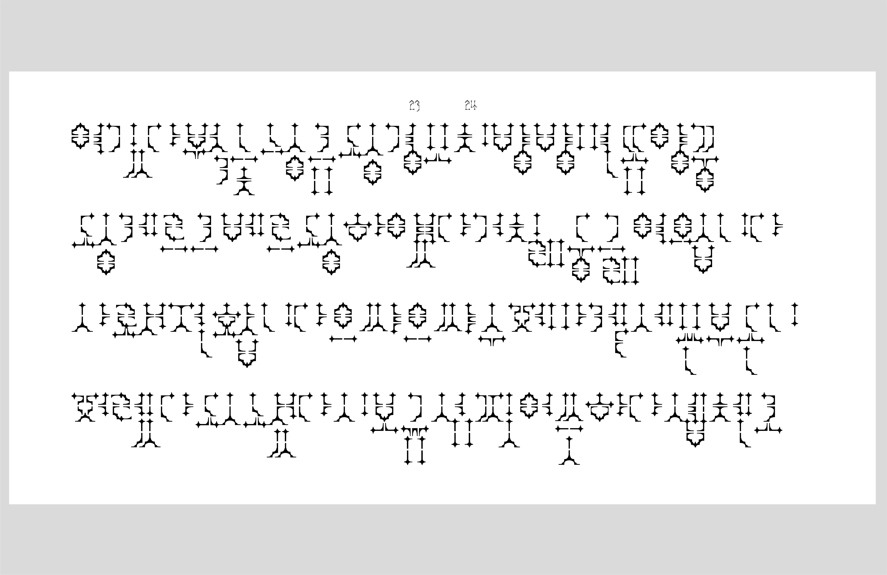
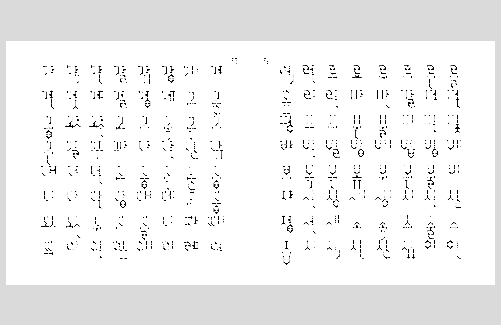
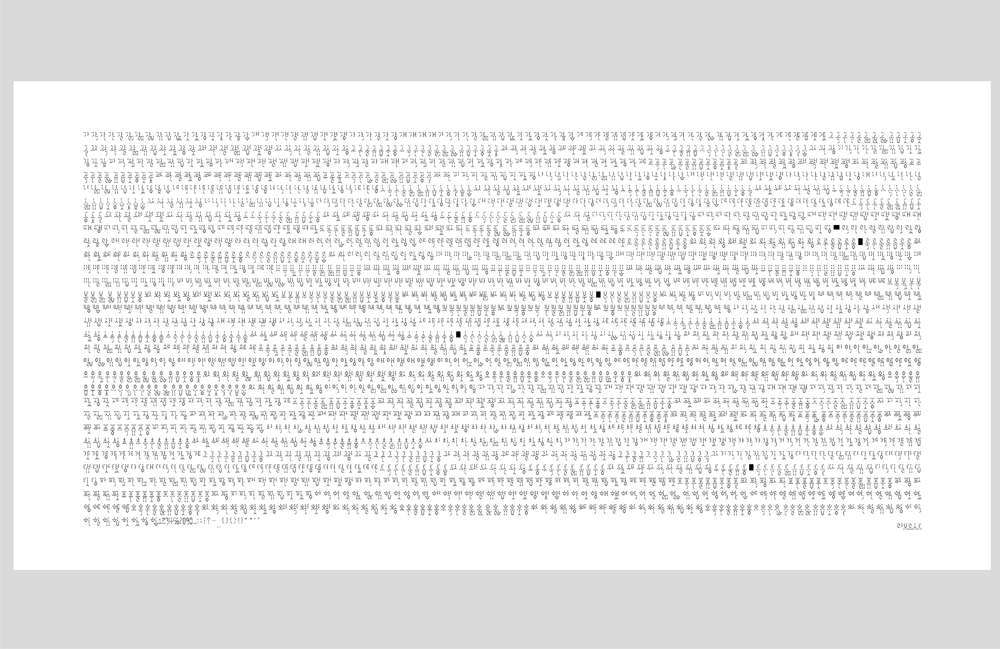

<figcaption>서체 뷰어</figcaption>

<iframe src="https://solm0.github.io/labrouste/"></iframe>

<figcaption>2023 국민대학교 시각디자인학과 소모임 연합 전시회 '모임모임'</figcaption>

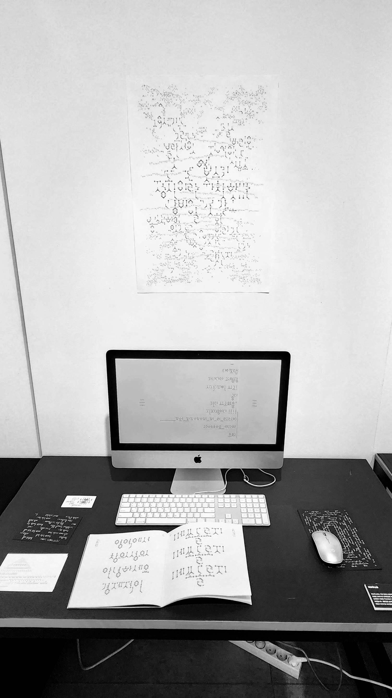