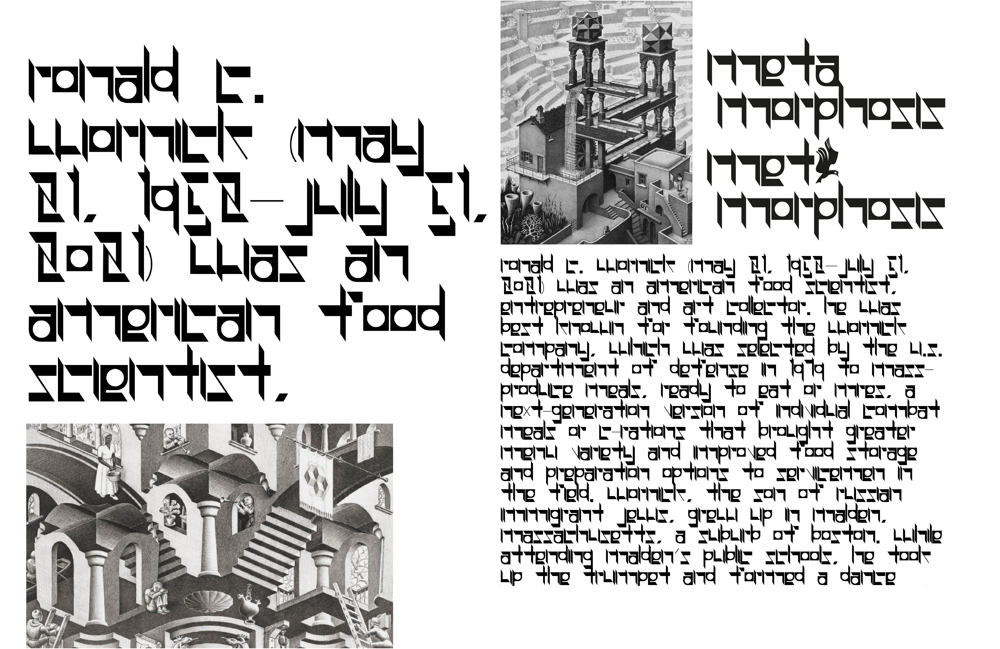
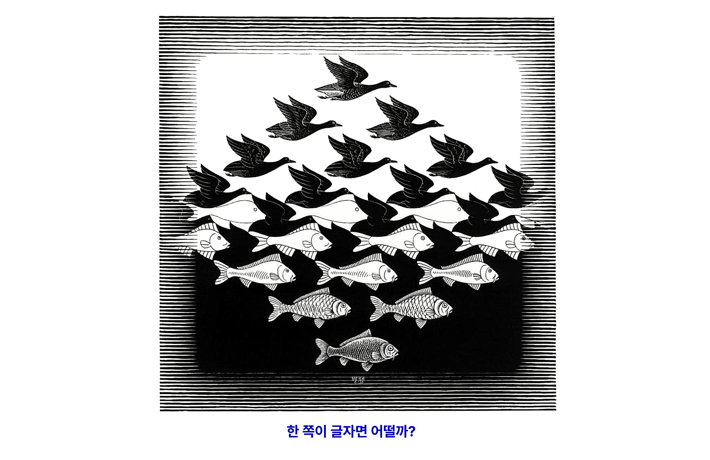
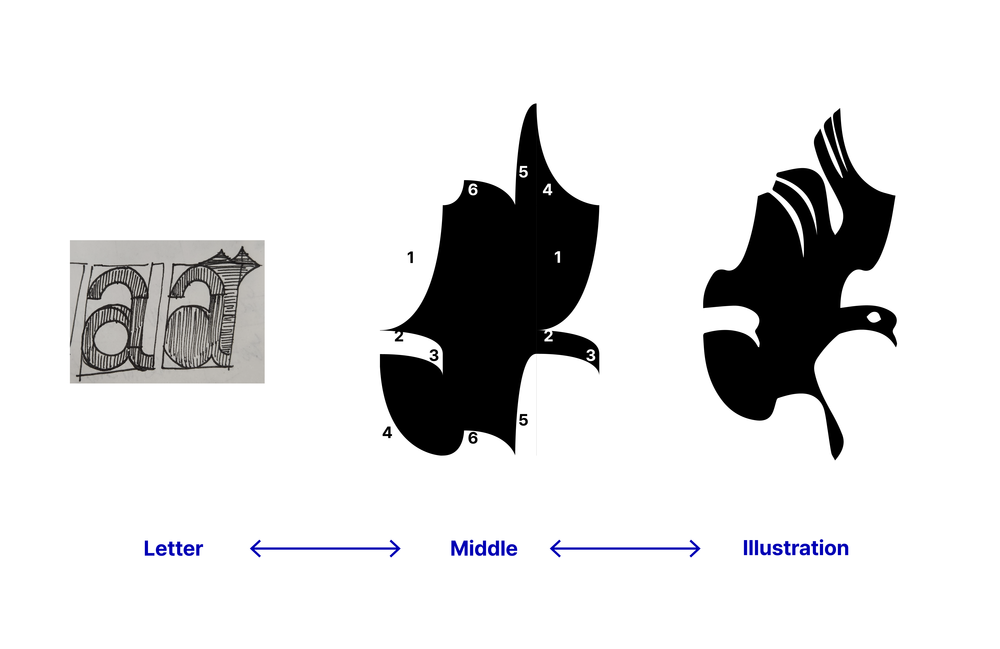
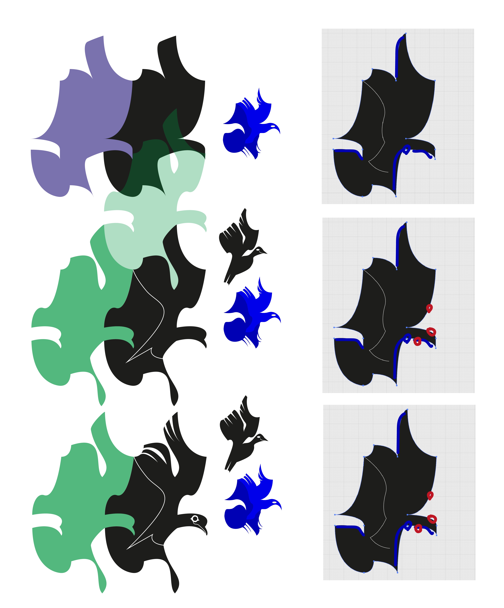
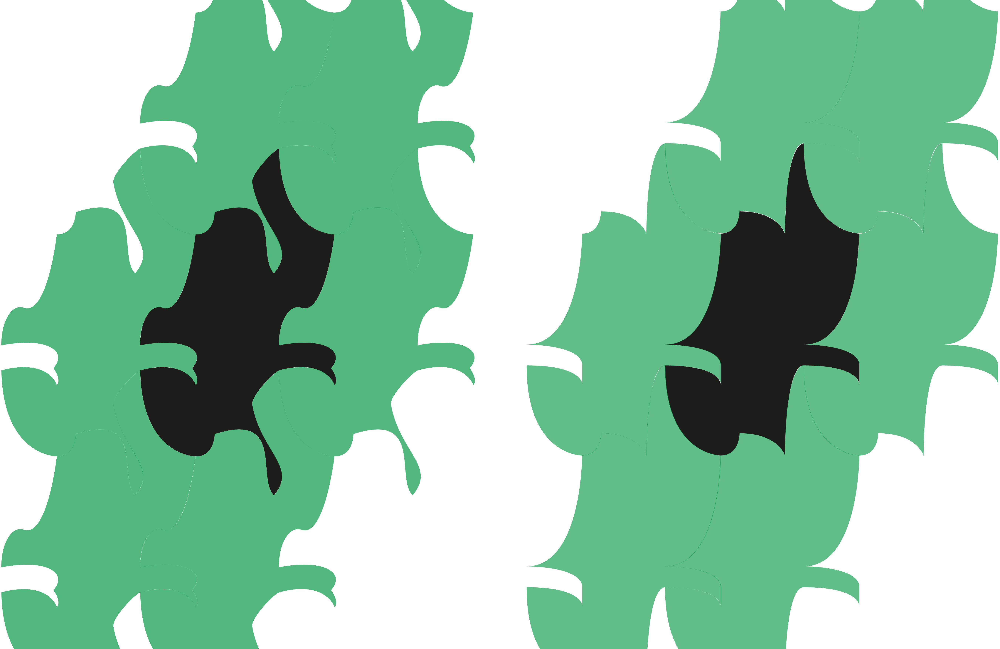

---
aliases:
  - Metamorphosis
layout: ../../layouts/WorksLayout.astro
type: works
tags:
  - web
  - typeface
  - css
  - variable_font
thumbnail: /metamorphosis.png
date: 2023
description: M.C.Escher의 테셀레이션 방법론 중 ‘평행이동’을 이용해 알파벳의 네거티브 스페이스가 날아가는 새의 포지티브 스페이스로 변형되는 베리어블 폰트를 만들고 웹 애니메이션을 만들었습니다.
---
<figcaption>웹 애니메이션 1</figcaption>

<iframe
  src="https://solm0.github.io/albatross/"
  style="width: 700px; height: 870px;"
></iframe>

<figcaption>웹 애니메이션 2</figcaption>
<iframe src="https://www.youtube.com/embed/tw-N7YOByo8?si=0gxExoMTWZi8-6oK" title="YouTube video player" frameborder="0" allow="accelerometer; autoplay; clipboard-write; encrypted-media; gyroscope; picture-in-picture; web-share" referrerpolicy="strict-origin-when-cross-origin" allowfullscreen></iframe>

<figcaption>Escher의 테마인 네거티브/포지티브 스페이스의 상호관계는 그가 평생 연구했던 판화의 수작업 과정에서 도출되었거나 강화된 아이디어라고 생각했다. 판화에서는 네거티브/포지티브 스페이스가 반전되기 때문이다. 따라서 판화 내부에 글자가 새겨진 방법을 유추해 만든 방법론으로 서체를 제작했다.</figcaption>

<figcaption>발표 슬라이드 일부</figcaption>

