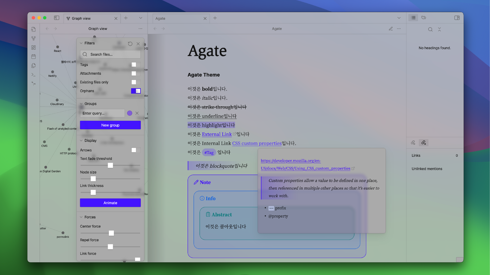
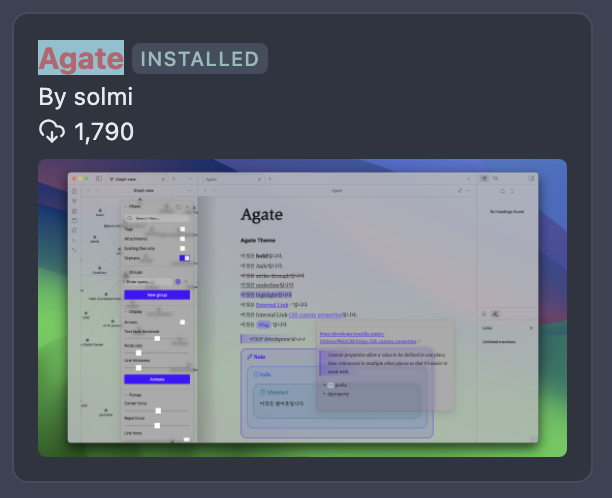

---
aliases:
  - Obsidian 테마 만들기
layout: ../../layouts/LogbooksLayout.astro
type: logbooks
date: 2024-06-30
tags:
  - web
  - obsidian
  - css
thumbnail: /img-00.png
overview: true
finished: true
projectId: obsidian-theme-agate
sequence: 0
---

## 개요
Obsidian 테마를 디자인하고 커뮤니티에 제출한 과정의 기록이다.

Digital Garden 플러그인으로 웹사이트를 배포할 때 내가 디자인한 테마를 쓰고 싶어서 테마를 만들게 되었다. 커뮤니티에 제출한 테마만 Digital Garden에서 사용할 수 있기 때문이다.

## 내용
[[css-style-obsidian|Obsidian은 CSS로 스타일링할 수 있다]].

[[obsidian-css-variable|Obsidian의 CSS variable]]을 사용해 디자인을 편집하고, [[micro-typography-in-obsidian|마이크로 타이포그래피]]를 하고, [[macro-typography-in-obsidian|매크로 타이포그래피]]를 했다. [[obsidian-plugins-i-used|플러그인]]도 사용해 보았다.

그리고 [[submit-your-theme|Obsidian 커뮤니티에 제출]] 했다.

통과해서 커뮤니티 테마에 올라갔다. 다운로드 횟수도 1000회를 넘었다.

그런데 어째서인지 언제부턴가 폰트가 적용이 안된다. 수정하기는 귀찮아서 방치 상태이다. 내려달라고 해야하나?