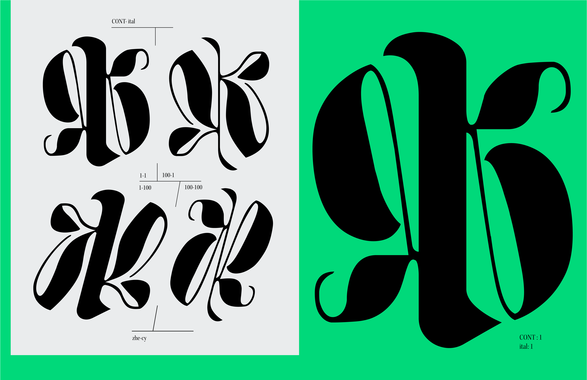
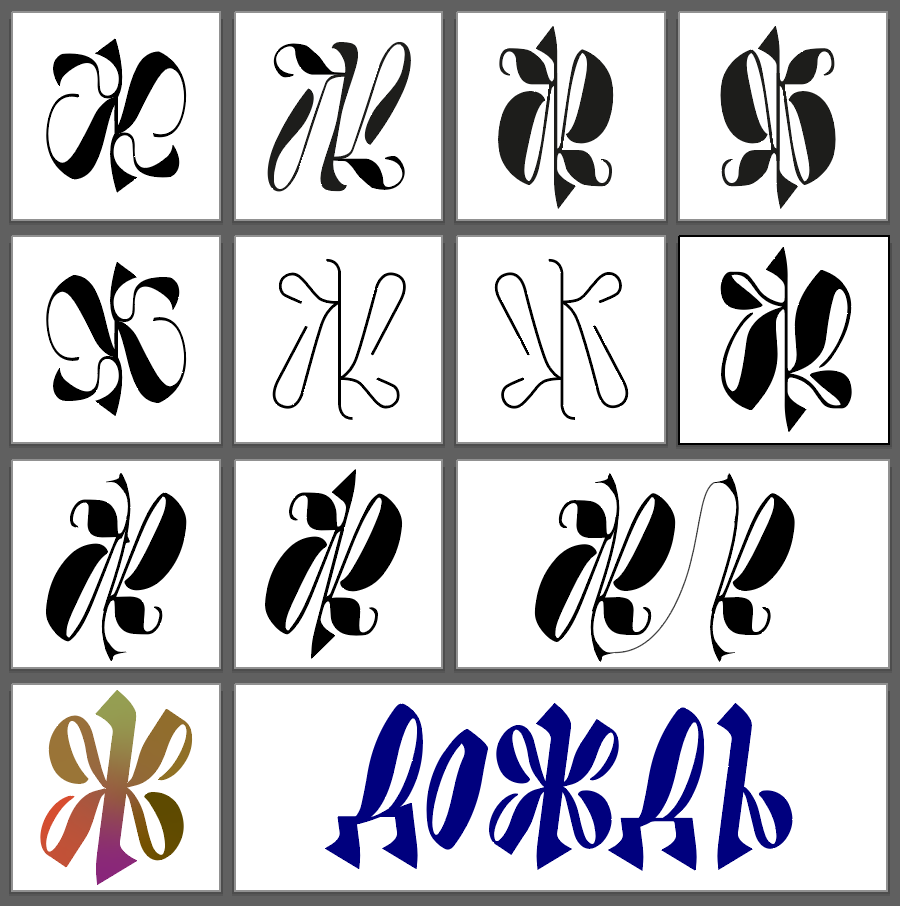
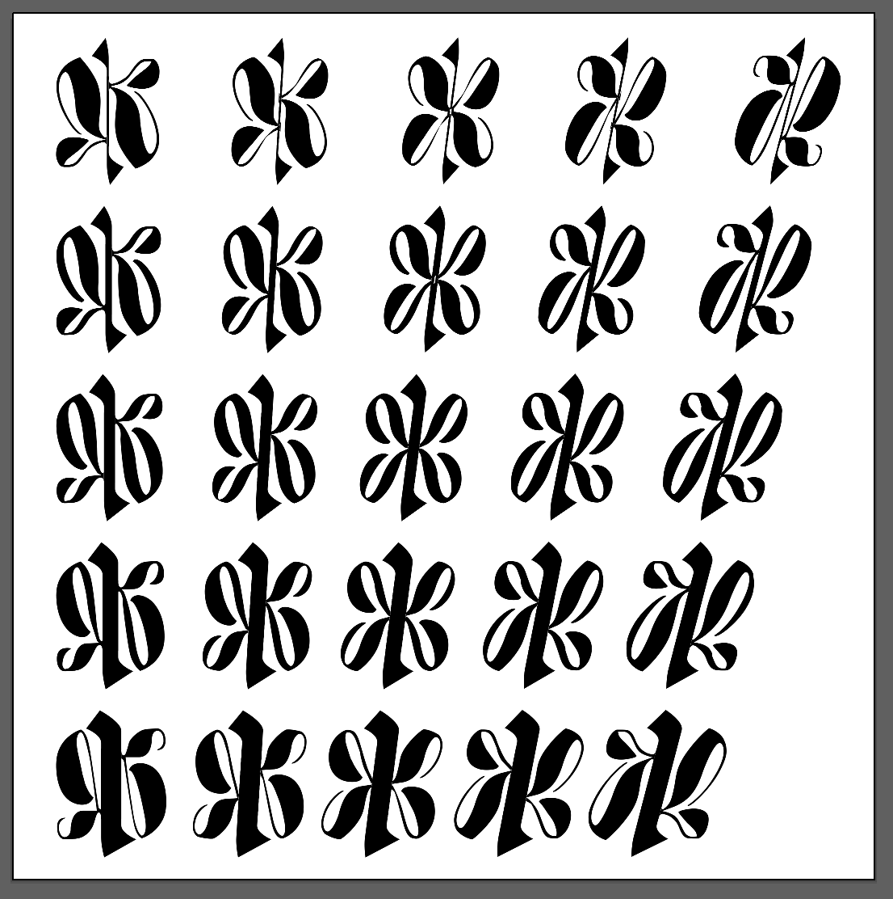

---
aliases:
  - Ж Variable
layout: ../../layouts/WorksLayout.astro
type: works
tags:
  - typeface
  - variable_font
  - cyrillic_script
  - russian
thumbnail: /zhe_vf_3.png
date: 2024-01
description: 러시아어 수업을 들으며 좌우대칭이 아닌 Ж 여러 개를 그려보다 만든 베리어블 폰트입니다.
---
<figcaption>베리어블 폰트 영상</figcaption>

  
  

<figcaption>variable axes: contrast, italic</figcaption>

<figcaption>아이디어 스케치</figcaption>

